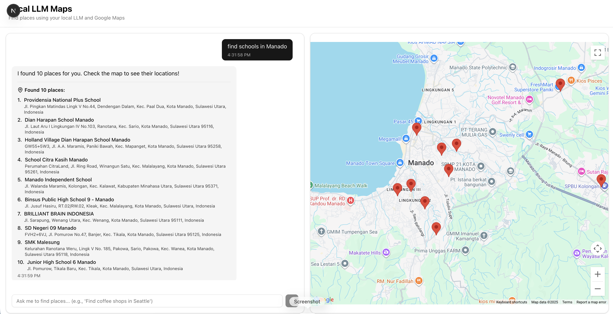

# Local LLM Maps Integration

Find places using your local LLM (LM Studio/Ollama) integrated with Google Maps.



## Features

- 🤖 **Local LLM Integration** - Uses your local LLM (Mistral 7B, Llama2, etc.) via LM Studio or Ollama
- 🗺️ **Interactive Google Maps** - View location suggestions on an embedded map with markers
- 📍 **Location Search** - Natural language queries like "Find coffee shops in Jakarta"
- 🧭 **Directions** - Get turn-by-turn directions from your location to any place
- 🔗 **Open in Google Maps** - Deep links to Google Maps app or web
- 🎨 **Modern UI** - Built with Next.js 16, React 19, Tailwind CSS 4, and shadcn/ui

## Quick Start

For detailed setup instructions, see [Quick Start Guide](./specs/001-llm-maps-integration/quickstart.md).

### Prerequisites

- Node.js 18+ and pnpm
- LM Studio or Ollama with a model loaded
- Google Maps API key (with Maps JavaScript API and Directions API enabled)

### Installation

```bash
cd src
pnpm install
cp .env.example .env.local
```

### Configuration

Edit `.env.local`:

```bash
# Google Maps API Key
NEXT_PUBLIC_GOOGLE_MAPS_API_KEY=your_api_key_here

# LLM Configuration
LLM_PROVIDER=lmstudio  # or "ollama"
LLM_BASE_URL=http://localhost:1234  # LM Studio default
LLM_MODEL=mistral-7b-instruct-v0.2
```

### Run

```bash
pnpm dev
```

Open [http://localhost:3000](http://localhost:3000)

## Usage

1. **Ask for places**: Type a query like "Find Italian restaurants in Bali"
2. **View on map**: See location markers on the interactive map
3. **Get details**: Click markers to see information
4. **Get directions**: Click "Directions" button and allow location access
5. **Open in Maps**: Click "Open" to view in Google Maps app/web

## Project Structure

```
src/
├── app/                    # Next.js App Router
│   ├── api/               # API routes (LLM, Places, Directions)
│   ├── page.tsx           # Main application page
│   └── layout.tsx         # Root layout with providers
├── components/            # React components
│   ├── chat/             # Chat interface components
│   ├── map/              # Map components
│   ├── locations/        # Location display components
│   └── ui/               # shadcn/ui components
├── lib/                   # Business logic
│   ├── llm/              # LLM clients (Ollama, LM Studio)
│   ├── maps/             # Google Maps services
│   ├── parsers/          # Response parsers
│   ├── contexts/         # React contexts
│   └── utils/            # Utilities
└── types/                 # TypeScript type definitions
```

## Technologies

- **Framework**: Next.js 16 with App Router
- **UI**: React 19, Tailwind CSS 4, shadcn/ui
- **Maps**: Google Maps JavaScript API, @react-google-maps/api
- **LLM**: LM Studio / Ollama with Mistral 7B or Llama2
- **Validation**: Zod
- **Language**: TypeScript 5

## API Endpoints

- `GET /api/health` - Health check for LLM and Google Maps services
- `POST /api/llm` - Process natural language queries
- `POST /api/places/enrich` - Enrich locations with Google Places data
- `POST /api/places/directions` - Calculate routes between two points

## Development

```bash
# Run development server
pnpm dev

# Build for production
pnpm build

# Start production server
pnpm start

# Lint code
pnpm lint
```

## Documentation

- [Feature Specification](./specs/001-llm-maps-integration/spec.md)
- [Implementation Plan](./specs/001-llm-maps-integration/plan.md)
- [Quick Start Guide](./specs/001-llm-maps-integration/quickstart.md)
- [Data Model](./specs/001-llm-maps-integration/data-model.md)
- [API Contracts](./specs/001-llm-maps-integration/contracts/api-spec.yaml)

## License

See individual component licenses in the quick start guide.

## Troubleshooting

### LLM Not Responding

- Ensure LM Studio/Ollama is running
- Check `LLM_BASE_URL` in `.env.local`
- Verify model is loaded

### Google Maps Not Loading

- Verify API key is correct
- Enable required APIs in Google Cloud Console
- Check browser console for errors

### No Location Results

- Make queries more specific (include city name)
- Check LLM model quality
- Review server logs for errors

For more troubleshooting, see the [Quick Start Guide](./specs/001-llm-maps-integration/quickstart.md#troubleshooting).
